# [fit]Identity

^Have any of you ever been at a conference, or a party, and have someone come up to you and say "Hey, it's great to see you again!" And you look at them and smile, but inside you think “Who are you?” [Raise your hand]

^Now usually, unless you’re really drunk, you eventually figure out who this person is - it's just someone you met earlier and forgot. But for me, it’s just as common to realize that no, I have never met that person. What I realize is that they actually met my twin sister, Andrea - come on up here, Andrea. Who here has mixed the two of us up at this conference? Who here only realized just now that there were two of us?

^This happens even with our friends. I have been to several parties at Andrea's house where I’m meeting her friends for the first time. Often, Andrea forgets to mention to her friends that she has a twin. (andrea shrugs) So there are a lot of times that her friends walk in the door and give me a hug before I can say “I’m not Andrea!”

^This kind of thing happens enough that Andrea and me that we're used to it, and it doesn't really bother us anymore. But it does make me think a lot about my identity. Can any of you imagine what it would feel like to be indistinguishable from another person, even on a superficial level? It kind of messes with your mind.

—

^Back when Andrea and I were cute little munchkins, identity didn’t matter much to us. But as we grew older, of course, it did begin to matter.  We wanted to be seen as separate people - with our own identities. We often get asked “Hey, did you ever switch classes in school?” Well, the answer is no. We never wanted to be mistaken for each other.  

—

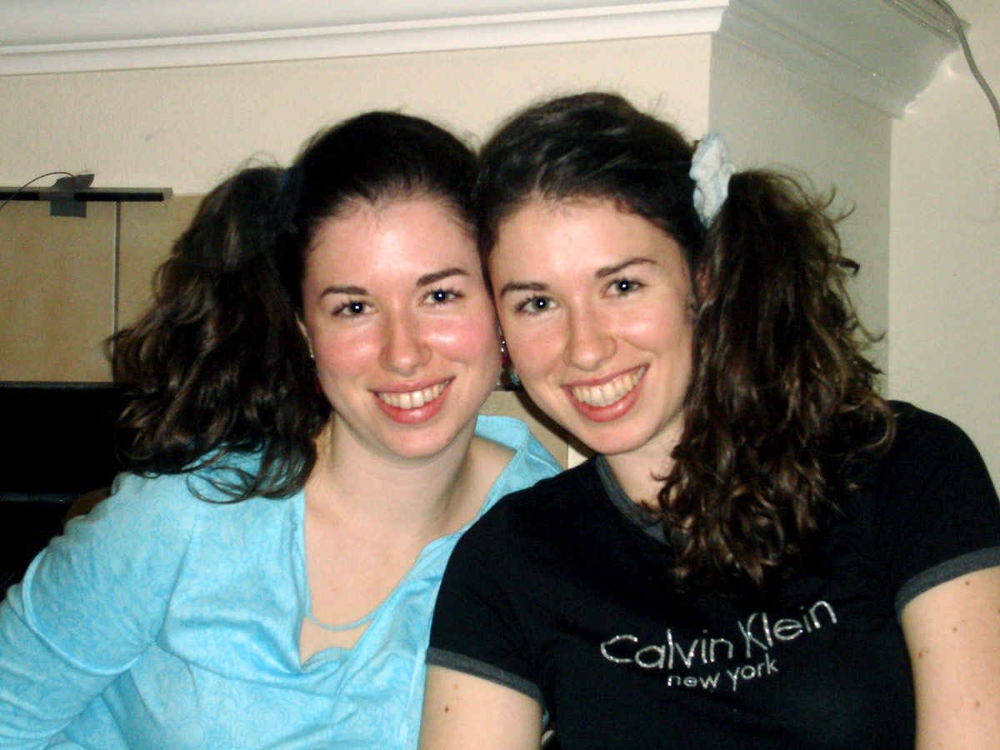

^ Unfortunately, my sister and I were very similar in both looks and personality, so this was often a losing battle. We both played soccer. We had mostly the same friends. Sometimes people would helpfully suggest “Hey, one of you should dye your hair purple!” Well, neither of us wanted to dye our hair. Plus, the only thing that would accomplish is that the person with purple hair

—

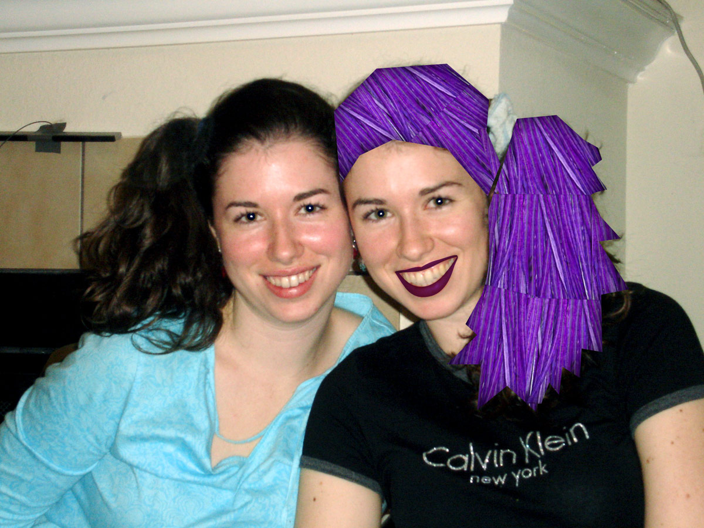

^ would look like this. And ultimately people would just know us as “the weird twin” “the normal twin”. 

—

^At any rate, our acquaintances often couldn’t tell us apart, or didn’t bother. Teachers, classmates, even soccer coaches. There have been so many times that I was standing right next to my soccer coach on the sideline and he’s yelling out “Vicki! Pass the ball!” And I’d have to tap him and say “Coach, I’m right here.”

—

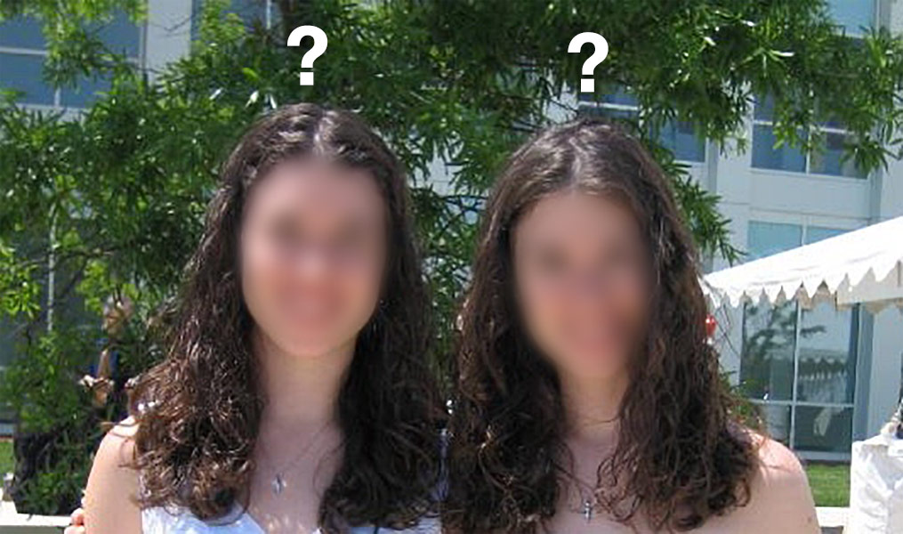

^Inside, I saw myself as Vicki. Outside, I was “one of the twins”. 

—

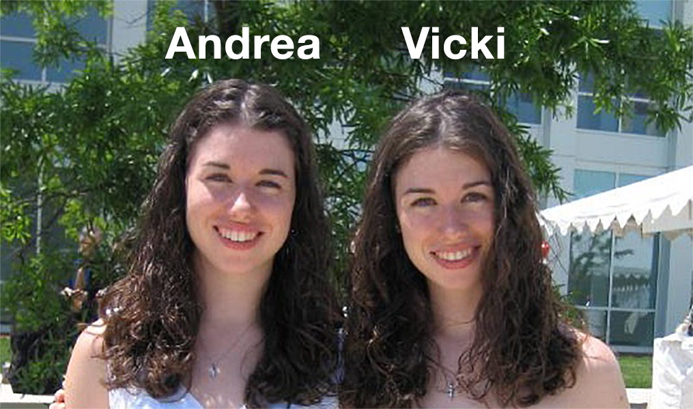

^ Luckily, we grew up, and things changed. We went to college and started having different life experiences. Being mistaken for my twin became a series of funny stories rather than a frustrating attempt to be seen as an individual. This, by the way, is why Andrea forgot to tell her friends she has a twin. She wasn’t purposefully instigating awkward moments - she just actually forgot. It wasn’t part of her inner identity.

^ You don’t have to be a twin to struggle with identity. In fact, it’s a much more powerful force in your life than you might realize. Each of us has our own identity, and it's split into two parts.

—

# [fit] Inner Identity 
## (how we see ourselves)

^First, there's our "inner identity", which is how we see ourselves. You might think of yourself as a "good daughter", or a "writer", or an "iOS developer."

—

# [fit]Outer Identity
## (how others see us)

^Second, there's our "outer identity", which is how others see us. You might actually be helping out your parents a lot, or actually writing every day, or actually having a day job as an iOS developer. 
^Can think of these two identities like looking in the mirror and seeing two reflections, with your inner identity layered over your outer identity.

—

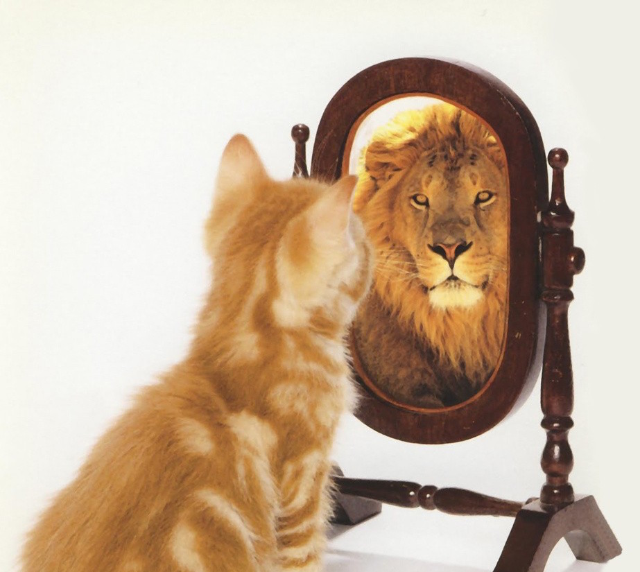

^Take the example of this kitten. When he looks in the mirror, he sees a lion. Does anyone have a cat like that? (raise hand) The thing is everyone else looks at him and sees a kitten.

—

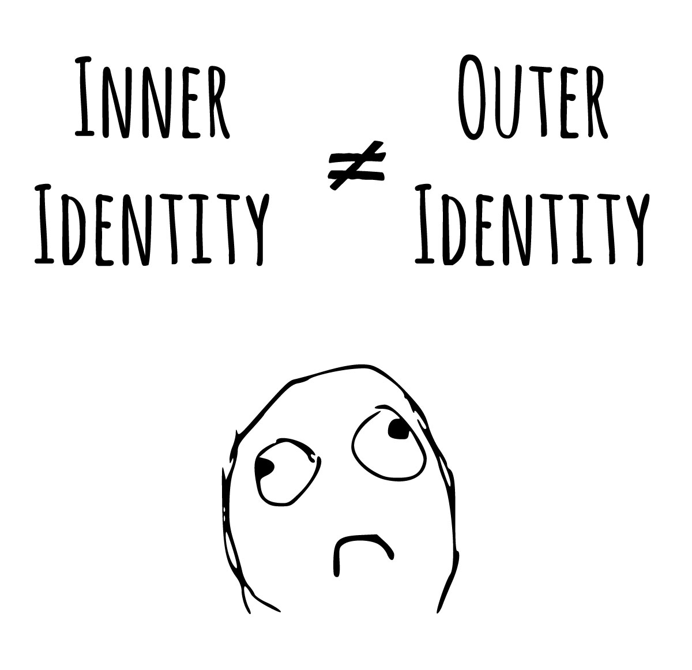

^Now, kittens aside, a serious problem arises when your inner identity and your outer identity don’t match.

^This leads to my next personal struggle with identity. 

—

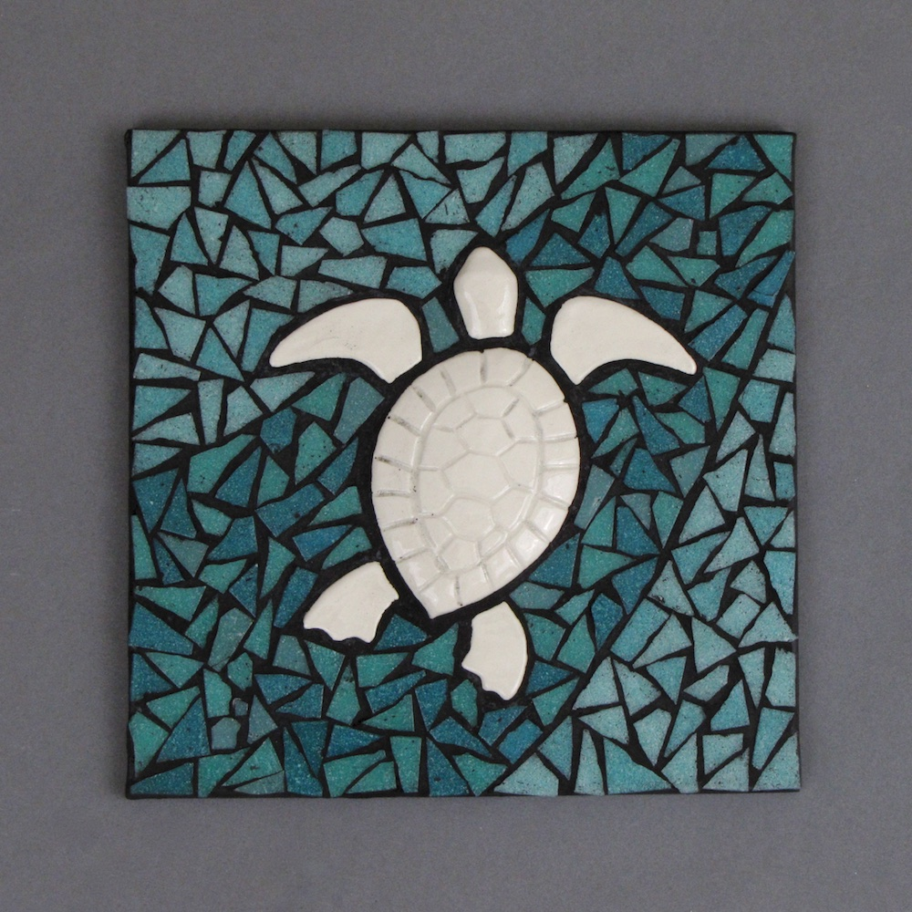
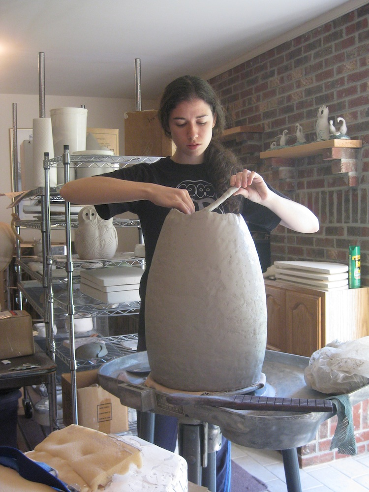

^After college, I became an ceramic artist. I’d always created ceramic art, but now I sunk my whole being into this new identity of mine. It was so fulfilling. Unfortunately, it didn’t pay very well.

—

^Somewhere along the line I started helping out this cute developer guy I was married to with his iPhone apps.
^Eventually, I was spending more time working with Ray on our apps and the blog than I was working on my own art. Finally, I decided to stop trying to turn my art into a business, and instead to focus on the thriving business Ray and I already owned.

—

^I told myself I was happy about this decision, but the truth was I was miserable. I resented every minute of it, even though it was interesting and challenging and, hey, paid the bills! Why? Because my inner identity was still as a ceramics artist. Every minute I worked on our business, in my head I was saying “Why am I not making a sculpture, or creating a mosaic? Why am I wasting my time, my life, with this other stuff?” There was this idea in my head, this inner identity that I clung to, that I was a ceramic artist.

—

^Maybe this problem sound small to you, but it got to where I didn’t want to even up in the morning. Ray would bound out of bed, excited and enthusiastic. I would look at his energy and wonder what was wrong with me. We work from home, so I did everything I could to get out of the house and away from the computer. When I was at my desk I would work slowly and reluctantly.

^ Now some of you are probably thinking “What’s is this girl’s problem? Either work with ceramics or work with ray, but stop moping.” Well, it didn’t make sense to me either. I knew I didn’t want to go backwards and return to ceramic art as a business. But I wasn’t moving forward either. I felt empty and lost. 

—

# Programmer

^Now, most of the time Ray is ridiculously enthusiastic about his work, but even he went through his own identity crisis. He is a programmer. That’s how he started this whole thing - that’s his identity. But as the business grew, he had to shift more and more of his time towards management to keep everything running smoothly. 

—

## ~~Programmer~~
# [fit]Manager
## (but really a programmer)

^It got to the point where he was barely doing any programming at all. The problem is, to Ray, “manager” was a dirty word. He subscribed to the common programmer belief that "managers don't do anything, programmers get the real work done.” So he wasn’t very happy since every time he looked in the mirror, he expected to see a programmer, and instead he saw a manager.

—

^When your inner and outer identities don't match, you feel false. You can become depressed, frustrated, and irritable.

—

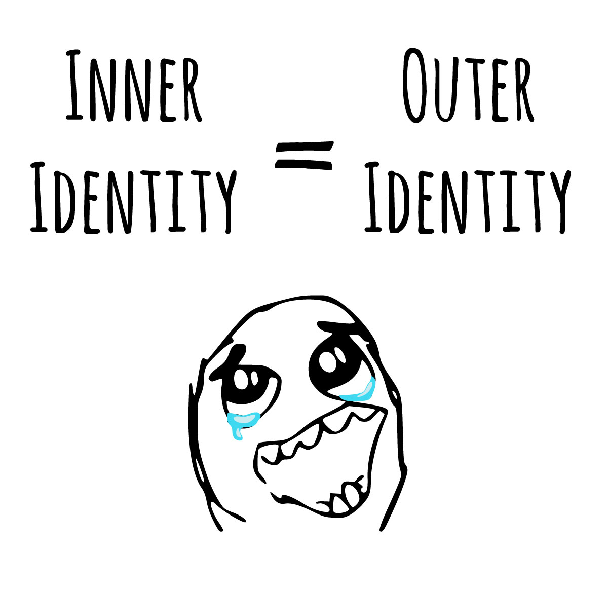

^When they do match, you feel like you are being true to yourself and your goals.
^You feel happy and fulfilled. But what do you do if you realize that your inner and outer identities…

—

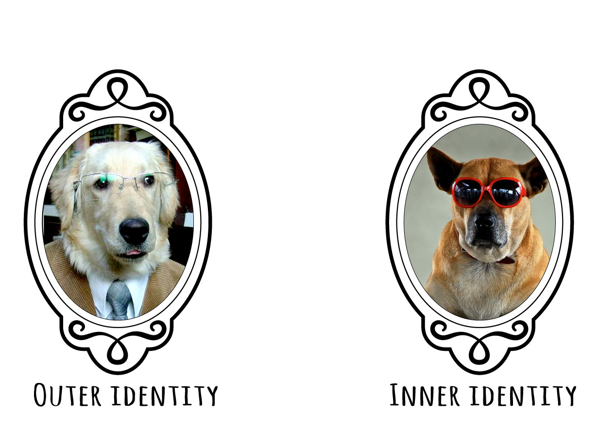

^…don’t match up? What do you do when your mirror shows two different reflections?

—

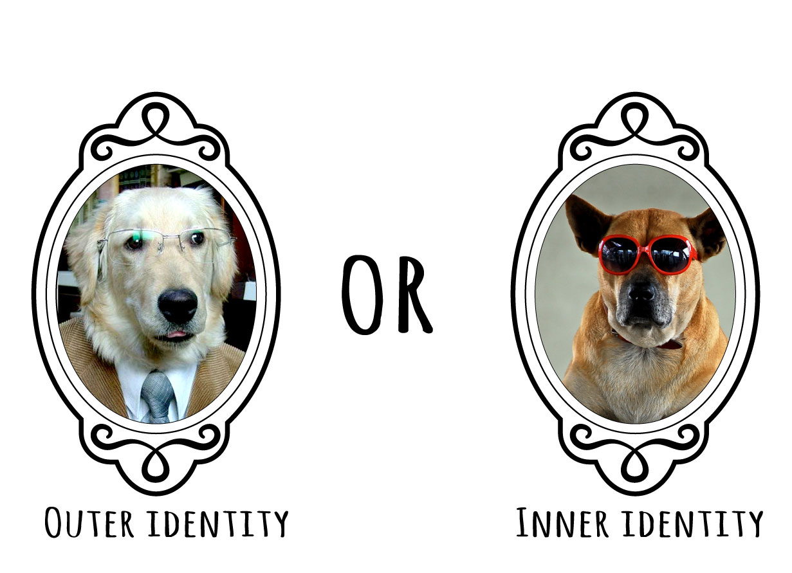

^Two choices

—

# Change Outer Identity

^Changing your outer identity means changing what you do so that it matches your inner identity. This might mean quitting your job, moving to a different location, joining a club, or starting a new habit. If you see yourself as a healthy, fit person and you’re not, then start a regular exercise program. If you see yourself as a free spirit and you’re tied down working at a bank, save up and go for a backpacking trip through Europe. If you see yourself as a brilliant app developer but don’t know any Swift, go to RWDevCon!

^Learn the skills you need to become the person you see inside.

—

^A great example of this comes from Jeff Wolski of the raywenderlich.com tutorial team. Once upon a time, Jeff taught app development at a technical college. He spent his nights and weekends coding. And did I mention he also had a wife and two kids? 
^All of those demands on his time took a heavy toll. One day, his body had enough, and Jeff found himself in the hospital.

—

^This prompted Jeff to reevaluate his life. He’d always thought of himself as an app developer who used teaching to make money. But he realized that truthfully, he was a teacher with a coding habit he didn’t have time for. And a teacher is not what Jeff wanted to be.

—

^Jeff quit his teaching career of over a decade and became a full time app developer. This, of course, meant he was full-time unemployed for a while. It wasn’t easy. It took over six months to be able to afford rent again. He worked hard, and things improved, and at this point he’s at a job he loves, building apps. It was worth all the stress he and his family went through because finally, his outer identity matches his inner identity as an app developer.

^So now we’ve seen an example of changing your outer identity to match your inner identity. But what if you decide you want to keep your outer identity? What if you decide “Hey - I actually like this job - or at least, it’s helping me accomplish my goals.” 

—

# Change Inner Identity

^Well, then you need to change your inner identity. Changing your inner identity means embracing your outer identity with open arms. It means saying, to yourself, “Hey, this is who I am, and I like it”.

—

# Managing = Good

^In Ray’s case, it meant recognizing that managing his team was really important. Somebody needed to do this work, and the alternative to being a manager was shutting the website down completely and going back to making apps. Ray wanted the website and our company to keep growing, so he had to change his way of thinking. He had to learn to understand that the manager is the person who keeps things running and organized, and that’s pretty important work. In short, he had to change his inner identity from “programmer” to “manager” and learn to be proud of that.

—

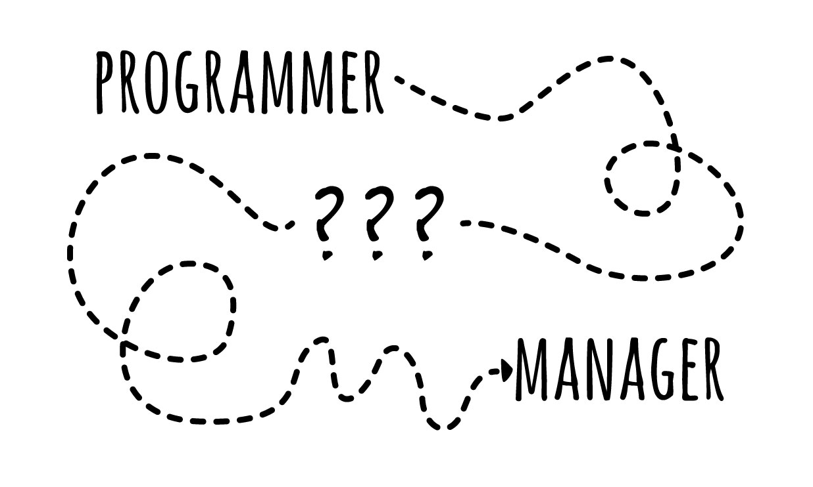

^Changing your inner identity, however, isn’t an instantaneous process. Your inner identity is rooted pretty deeply in your psyche. So how do you change your inner identity? With patience, self-awareness, and words.

—

# [fit]Words
## are
# [fit]Powerful

^Pick out the great things about who you are, and repeat them to yourself every day. Say them out loud, or write them down on paper.  The way we talk to ourselves makes a big difference. For Ray, instead of saying to himself. “Ugh - another day wasted answering emails and managing the team instead of programming”, he said “Answering those emails was really important - it helped all of our projects make progress and kept the team running smoothly.”

^Eventually, your identity will shift to match your words, your mirror will stop arguing with you, and you will feel like you are acting true to yourself once more.

—

# [fit]Artist
# or
# [fit]Entrepreneur?

^Here’s what those two choices looked like for me: I could either change my outer identity, which meant telling my husband that he was on his own with his business and I was heading into the ceramic studio. Or I could change my inner identity and embrace my new role as an entrepreneur. 

—

# [fit]Entrepreneur

^I decided on the latter, because I realized I liked a lot of the things I was learning. I liked creating artwork 

—

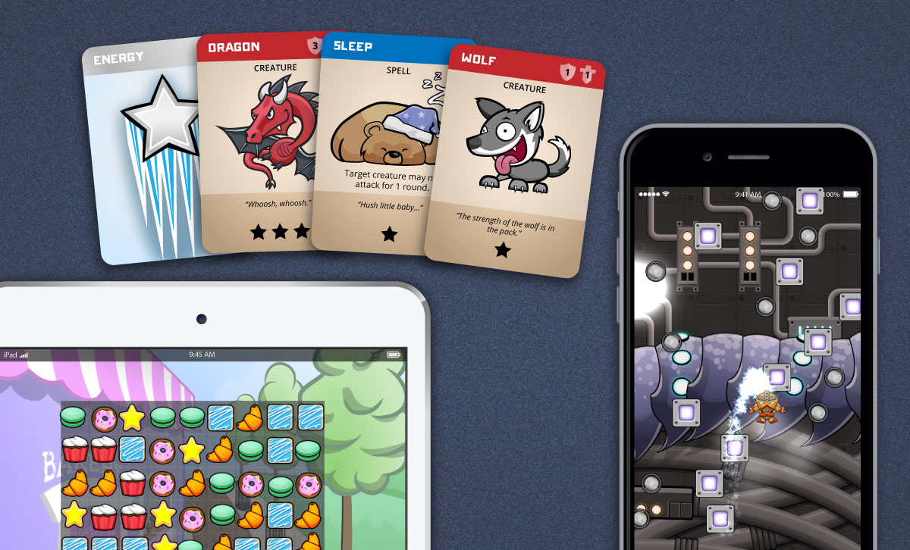

^that was actually used and appreciated. I liked learning what it takes to publish a book, or run a conference. 

^It was only my insistence on clinging to an inner identity as a ceramics artist that had been making me miserable.

^Once I realized that, I started changing what I said to myself. I started purposefully picking out the things I liked about being an entrepreneur, and describing what I did in a more positive light. For example, you might notice that I call myself an entrepreneur. I don’t know if I really fit the technical description of being an entrepreneur, but it makes me sound cool to myself and is a lot shorter than saying "illustrator, accountant, book publisher, jack of all trades who just has to get things done to keep the business going."

—

^Once I started shifting my inner identity, I got a lot more excited about my work. Before, my inner identity was: "I am an artist, but right now I'm helping my husband with his business". Now, my inner identity is like this: "I am an entrepreneur, and I can tackle anything that comes my way". Do you see the difference that makes? 

—

^Remember back to beginning of this speech, where I talked about my occasional frustration growing up as an identical twin? Looking back, this also was an example of inner identity versus outer identity - I thought of myself as a wonderful, unique, special snowflake, but others saw me as just "one of the twins." It was the mismatch between my outer identity and my inner identity that caused me so much anguish. 
^As an adult, I don't have that problem anymore. Most of the world sees me as very different from my sister - even if they confuse us at parties from time to time. Being a twin is only one piece of my outer identity, rather than the entire thing. So don't worry - if you come up to me and think I'm Andrea, I won't hate you. Just - don't hug me until we know each other better!

—

# What about you?

^
My challenge to you today is to take stock of your inner and outer identity. If the two align, it can make you happy and successful. If there is a mismatch, it will make you depressed and apathetic, holding you back in your personal life as well as in your career. 

^Give this concept of identity the respect and attention it deserves, and take the time to really look at yourself and see if something’s not right. And if you do feel depressed, and you realize that it’s because your inner and outer identity have a mismatch, be brave enough to take steps to bring the two back together again.

—

# Are you being true to yourself?

^Every so often, take a hard look in that mirror and ask this question: "Am I being true to myself?" If the answer is no, it's time to make a change.

^Thank you.

