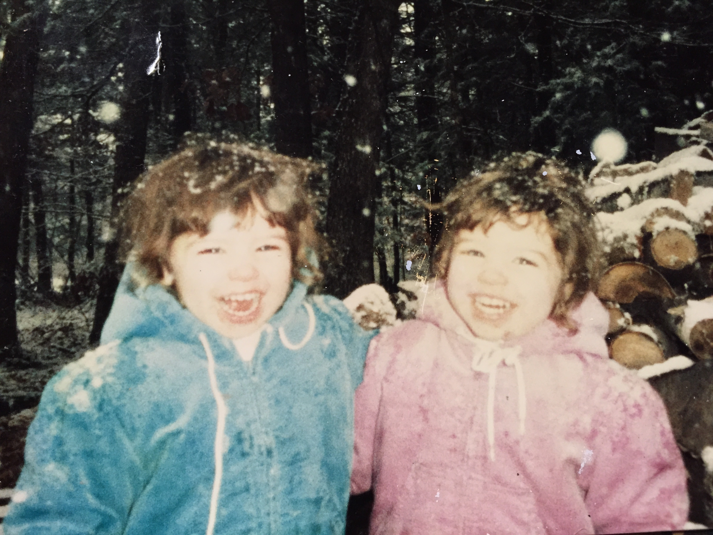

# [fit]Identity

^Have any of you ever been at a conference…

^Now usually, unless you’re really drunk…
^But for me,
^Andrea, come up here. How many of you…

^This happens even with our friends.

^This kind of thing happens enough that Andrea and me…

—

^Back when Andrea and I were cute little munchkins
^We wanted to be seen as separate people
^“Did you ever switch classes in school?”
^Unmemorable - exchangeable - stand out

—

^ Unfortunately, similar in both looks and personality.
^We both played soccer.
^Dye hair

—

^ “the weird twin” “the normal twin”. 

—

^At any rate, our acquaintances often couldn’t tell us apart
^Coach

—

^ Both of us had our inner identities as individual
^Then we had the outer reality of our lives…

—

^The vast majority saw us as interchangeable
^Inside
^Outside
^Discord constantly disappointed

—

^ Luckily, we grew up, and our outer reality changed.
^inner identity as a unique individual finally matched my outer reality of how people saw me. 
^Being mistake funny
^That’s why Andrea forgot
^Shopping

^ You don’t have to be a twin to struggle with identity. 
^ Split into two parts

—

# [fit] Inner Identity 
## (what we think of ourselves)

^Who we think we are. 

—

# [fit]Outer Identity
## (how others see us)

^What we're actually doing with our lives.

—

^Mirror

—

^The problem arises…
^Example: healthy but junk food and no exercise

^This leads to my next personal struggle with identity. 

—

^Ceramic artist, new identity
^Started helping out cute guy

—

^Apps
^Eventually,
^Finally,

^Happy but miserable.
^Resented
^Because inner identity of ceramic artist. That meant…
^Outer identity was as a graphics designer and entrepreneur - and this mismatch caused me a lot of unhappiness. 
^Every minute I worked on our business
^Idea in my head
^constant conflict

—

^Didn’t want to get up
^Ray bound out of bed, look at his energy…
^Errands, slow
^Slacker

^ “What’s is this girl’s problem? Either work with ceramics or work with ray, but stop moping.” ^It didn’t make sense to me either. 
^I knew I didn’t want…
^But this new thing…
^I wasn’t going back, but I wasn’t moving forward either. I felt empty and directionless.

—

# Programmer

^I saw this happen with Ray as well.
^Shift his time

—
## ~~Programmer~~
# [fit]Manager
## (but really a programmer)

^Barely doing any programming at all
^Mirror
^He felt unhappy, identity didn’t match
^Sure, the blog was successful…

—

^You have inner identity, and you have outer identity. 
^In happy people, they match up.
^when it does, you feel like you are being true to yourself and your goals. 
^excited, powerful, explore, achieve
^When they don't match, you feel false. Person in head

—

^So what do you do

—

^ when your inner identity and outer identity drift apart?

—

^What do you do when your mirror shows two different reflections?

—

^Two choices

—

# Change Outer Identity

^changing what you do so that it matches your inner identity. 
^Healthy fit person
^Free spirit
^brilliant app dev
^Learn the skills you need
^Change what’s happening on the outside to match the inside so that you are being true to yourself. 

—

# Jeff Wolski

^Once upon a time, taught at tech and programmed on side
^iPhone > app dev program
^Jeff in charge, extra work and stress.
^Also teaching, wife and kids, coding
^Hospital
^app dev who used teaching vs. teacher with coding habit
^Quit. unemployed. Moved out of home and in with mom. Six months for rent.
^Worked hard, now happily working building apps. Worth all the stress because now inner matches up with outer.

^So now we’ve seen an example
^But what if you decide…

—

# Change Inner Identity

^embracing your outer identity with open arms

—

# Managing = Good

^managing his team was really important
^alternative
^To do this, Ray had to change his way of thinking. "manager”. Common programmer feeling
^Had to learn to understand
^He changed his inner identity to match his outer identity as a manager.

^Changing inner identity not instantaneous. psyche. 
^Change with patience, self-awareness, and words.

—

# [fit]Words
## are
# [fit]Powerful

^Words are powerful. Great things
^Out loud, paper
^The way we talk
^Ray, instead of saying to himself
^Eventually, your identity will shift - mirror - true

—

# [fit]Artist
# or
# [fit]Entrepreneur?

—

# [fit]Entrepreneur

^Artwork that was used

—

^Accounting - capable - new skills
^Only insistence

^Once I realized that. Purposefully picking, describing
^Call myself Entrepreneur

—

^Once I started shifting
^Before, identity
^Now, identity
^hen your inner aligns with identity, true, confident, powerful, and happy.

—

^Remember back?
^example of inner versus outer identity 
^wonderful, unique, special snowflake vs ”one of the twins."
^Mismatch that caused me so much anguish. 
^Every time confused, was a reminder
^As an adult… Most see as different, even if they confuse us at parties from time to time. 
^Being a twin is only one piece of my outer identity
^So don't worry - if you come up to me - just don’t hug!

—

# Are you being true to yourself?

^Challenge today
^If align, happy and successful. 
^If mismatch, depressed and apathetic, personal and career. 
^Realize inner and outer identity may change over time, and that’s okay. 
^In fact, good - not same today as last year.

^Give concept of identity…
^Take the time to look and see if not right
^If do feel depressed, and realize, be brave enough

^Every so often

